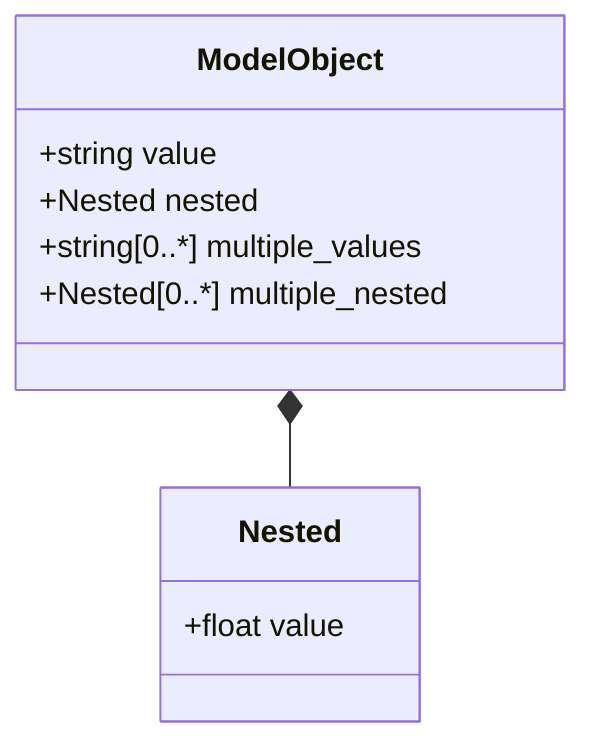

```mermaid
classDiagram
    ModelObject *-- Nested
    
    class ModelObject {
        +string value
        +Nested nested
        +string[0..*] multiple_values
        +Nested[0..*] multiple_nested
    }
    
    class Nested {
        +float value
    }
    
```